# DOKUMENTASI HASIL AUDIT WEBSITE & RANCANGAN ANTARMUKA (UI MOCKUP)
## SISTEM INFORMASI SURAT MENYURAT AKADEMIK DIGITAL
### FAKULTAS PERTANIAN - UNIVERSITAS LAMBUNG MANGKURAT (ULM)

Dokumen ini disusun untuk memenuhi kebutuhan dokumentasi perancangan sistem informasi pada **BAB III Skripsi/Tugas Akhir**. Seluruh data, alur, menu, dan komponen yang didokumentasikan di sini sepenuhnya berbasis pada audit kode sumber (*source code*) riil dalam proyek website **TA-ULM**.

---

## 1. Daftar Halaman Sistem

Berdasarkan hasil audit struktur direktori dan kode program, sistem ini membagi hak akses ke dalam 5 peran pengguna (*role*). Berikut adalah daftar seluruh halaman aktif yang tersedia pada sistem:

### A. Halaman Publik & Autentikasi
1. **Halaman Login** (`auth/login.php`): Form autentikasi pengguna menggunakan NIM/Username dan Password.
2. **Halaman Verifikasi QR Code** (`verifikasi_qr.php`): Halaman publik yang dapat diakses melalui pemindaian QR Code pada surat tercetak untuk memvalidasi keaslian dokumen secara realtime.

### B. Halaman Aktor: Mahasiswa (`user/`)
1. **Dashboard Mahasiswa** (`user/index.php`): Menampilkan sambutan, pengumuman mading fakultas terbaru, diagram alur pengajuan surat, serta tabel riwayat pengajuan surat pribadi.
2. **Form Pengajuan Surat Mahasiswa Aktif** (`user/ajukan_surat_aktif.php`): Form input untuk mengajukan Surat Keterangan Mahasiswa Aktif.
3. **Form Pengajuan Surat Izin Penelitian** (`user/ajukan_surat_penelitian.php`): Form input untuk pengajuan surat izin melakukan penelitian skripsi/tugas akhir.
4. **Form Pengajuan Surat Pengantar PKL** (`user/ajukan_surat_pkl.php`): Form input untuk pengajuan Surat Pengantar Praktik Kerja Lapangan (PKL)/Magang.
5. **Form Pengajuan Surat Izin Kuliah** (`user/ajukan_surat_izin.php`): Form input bagi mahasiswa yang berhalangan mengikuti perkuliahan.
6. **Form Pengajuan Keterangan Alumni** (`user/ajukan_surat_alumni.php`): Form pengajuan surat keterangan bagi mahasiswa yang telah lulus.
7. **Form Pengajuan Keterlambatan UKT** (`user/ajukan_surat_keterlambatan_ukt.php`): Form pengajuan dispensasi keterlambatan pembayaran Uang Kuliah Tunggal (UKT).
8. **Form Pengajuan Keterangan Lulus** (`user/ajukan_surat_keterangan_lulus.php`): Form pengajuan Surat Keterangan Lulus (SKL) sebelum wisuda.
9. **Halaman Profil Saya** (`user/profil.php`): Halaman untuk mengunggah foto profil, mengedit data diri, serta mengubah password akun mahasiswa.

### C. Halaman Aktor: Dosen (`dosen/`)
1. **Dashboard Dosen** (`dosen/index.php`): Menampilkan daftar riwayat kegiatan akademik yang pernah dibuat dan status persetujuan pimpinan.
2. **Form Buat Kegiatan** (`dosen/buat_kegiatan.php`): Form masukan untuk mendaftarkan kegiatan akademik baru (praktikum, penelitian, pengabdian) beserta daftar mahasiswa yang dilibatkan.
3. **Detail Kegiatan** (`dosen/detail_kegiatan.php`): Menampilkan detail data kegiatan akademik beserta lampiran dokumen pendukung.

### D. Halaman Aktor: Dekan / Pimpinan (`dekan/` & `auth/index.php`)
1. **Dashboard Dekan** (`dekan/index.php`): Menampilkan ringkasan surat-surat mahasiswa yang memerlukan persetujuan tanda tangan elektronik pimpinan.
2. **Halaman Kegiatan Akademik** (`dekan/kegiatan_akademik.php`): Menampilkan daftar kegiatan akademik dosen yang diajukan untuk disetujui.
3. **Form Ajukan Surat Tugas Dosen** (`dekan/ajukan_surat_tugas_dosen.php`): Form pimpinan untuk menugaskan dosen dalam kegiatan tertentu.
4. **Detail Surat** (`dekan/detail_surat.php`): Halaman verifikasi akhir pimpinan sebelum membubuhkan tanda tangan elektronik.
5. **Dashboard Persetujuan Cepat** (`auth/index.php`): Halaman khusus persetujuan satu klik untuk mempercepat alur administrasi.

### E. Halaman Aktor: Administrator (`admin/`)
1. **Dashboard Admin** (`admin/index.php`): Halaman utama manajemen pengajuan surat masuk dari seluruh mahasiswa beserta filter status (Pending, Diproses, Selesai, Ditolak).
2. **Kelola Mading** (`admin/mading.php`): Halaman input dan edit informasi pengumuman mading fakultas yang terbit di dashboard mahasiswa.
3. **Rekap Laporan** (`admin/rekap.php`): Halaman filter data, grafik statistik Chart.js, rekapitulasi waktu pemrosesan rata-rata surat, dan opsi ekspor rekap PDF.
4. **Statistik** (`admin/statistik.php`): Visualisasi performa layanan persuratan.
5. **Backup & Restore** (`admin/backup_restore.php`): Antarmuka manajemen basis data SQL untuk mengamankan data transaksi sistem secara berkala.
6. **Verifikasi Surat** (`admin/verifikasi.php`): Form detail surat masuk untuk membubuhkan nomor surat resmi, mengubah status, serta memberikan catatan revisi kepada pengaju.
7. **Verifikasi Kegiatan** (`admin/verifikasi_kegiatan.php`): Halaman approval kegiatan akademik dosen.

---

## 2. Rancangan Antarmuka Masukan (Input) Sistem

### A. Halaman Login (`auth/login.php`)
* **Fungsi Halaman**: Mengautentikasi pengguna berdasarkan hak akses masing-masing agar dapat masuk ke dalam panel sistem persuratan.
* **Komponen UI**:
  - Logo ULM (Fakultas Pertanian).
  - Kolom Input Teks: *Username / NIM*.
  - Kolom Input Password: *Password* (dilengkapi tombol *show/hide password* mata coret).
  - Tautan Popover: *Lupa Password?*.
  - Tombol Submit: *Masuk* (Warna kuning emas).
* **Deskripsi Rancangan**: Didesain dengan kartu putih bersih (*rounded-card*) di tengah latar belakang gradasi gelap navy-blue yang elegan. Desain ini meminimalkan gangguan visual sehingga pengguna fokus pada form masuk.
* **File Mockup**: `assets/img/rancangan/login_page_v2.png`

### B. Form Pengajuan Surat Mahasiswa (`user/ajukan_surat_aktif.php` dsb.)
* **Fungsi Halaman**: Memfasilitasi mahasiswa dalam menginput permohonan surat akademik baru.
* **Komponen UI**:
  - Sidebar Navigasi di sebelah kiri.
  - Navbar atas berisi avatar profil mahasiswa dan NIM.
  - Form Input:
    - *Nama Lengkap* (Teks - Readonly).
    - *NIM* (Teks - Readonly).
    - *Program Studi* (Teks - Readonly).
    - *Semester* (Angka - Wajib diisi).
    - *Keperluan* (Textarea - Deskripsi tujuan surat).
  - Tombol Aksi: *Ajukan Surat* (Kuning Emas) dan *Batal* (Abu-abu).
* **Deskripsi Rancangan**: Layout form menggunakan panel lebar yang nyaman dibaca. Input data mahasiswa ditarik otomatis dari database (*readonly*) untuk mencegah kesalahan input NIM/Nama.
* **File Mockup**: `assets/img/rancangan/form_ajukan_surat.png`

### C. Halaman Profil & Sandi Mahasiswa (`user/profil.php`)
* **Fungsi Halaman**: Tempat mahasiswa memperbarui berkas foto profil, data email/telepon aktif, dan mengganti kata sandi demi keamanan akun.
* **Komponen UI**:
  - Sidebar & Top Navbar.
  - Card 1 (Profil): Input *Email*, *Telepon*, serta *Unggah Foto* (Avatar).
  - Card 2 (Ubah Sandi): Input *Password Lama*, *Password Baru*, dan *Konfirmasi Password Baru*.
  - Tombol Aksi: *Simpan Perubahan* dan *Ubah Password*.
* **Deskripsi Rancangan**: Menggunakan dua kartu berdampingan (*two-column layout*) yang memisahkan antara data kontak umum dengan data keamanan kredensial akun.
* **File Mockup**: `assets/img/rancangan/profil_mahasiswa.png`

### D. Form Buat Kegiatan Akademik Dosen (`dosen/buat_kegiatan.php`)
* **Fungsi Halaman**: Digunakan dosen untuk mendaftarkan kegiatan akademik terpadu yang melibatkan sekelompok mahasiswa.
* **Komponen UI**:
  - Form Teks: *Nama Kegiatan*, *Lokasi Kegiatan*.
  - Dropdown: *Jenis Kegiatan* (Praktikum, Penelitian, Pengabdian, Seminar, Kunjungan Industri).
  - Textarea: *Deskripsi*.
  - Date Picker: *Tanggal Kegiatan*.
  - File Uploader: *Lampiran Dokumen* (.pdf / .docx).
  - Panel Pencarian & Multi-select Checkbox: *Pilih Mahasiswa* (Daftar nama mahasiswa aktif dapat dicari dan dicentang untuk dimasukkan sebagai peserta).
  - Tombol Submit: *Buat Kegiatan* (Biru gradasi).
* **Deskripsi Rancangan**: Form dibuat panjang dengan pengelompokan logis. Bagian bawah form memiliki kolom pencarian khusus untuk memfilter daftar mahasiswa aktif secara instan sehingga memudahkan dosen mengaitkan banyak mahasiswa sekaligus.
* **File Mockup**: `assets/img/rancangan/form_buat_kegiatan.png`

---

## 3. Rancangan Antarmuka Keluaran (Output) Sistem

### A. Dashboard Mahasiswa (`user/index.php`)
* **Fungsi Halaman**: Memberikan informasi terintegrasi mengenai pengumuman terbaru fakultas dan status pelacakan surat secara realtime.
* **Komponen UI**:
  - Banner Selamat Datang dinamis (menampilkan nama lengkap mahasiswa).
  - Card Mading: Menampilkan pengumuman fakultas dengan visual gambar opsional.
  - Panel Alur Pengajuan: Infografis langkah-langkah pengajuan surat dari pengajuan hingga cetak.
  - Tabel Riwayat Surat: Kolom berisi *No, Tanggal Pengajuan, Jenis Surat, Keperluan, Status* (badge warna: Kuning untuk Pending, Biru untuk Diproses, Hijau untuk Selesai, Merah untuk Ditolak), dan kolom aksi untuk mencetak PDF jika status telah selesai.
* **Deskripsi Rancangan**: Layout dashboard menggunakan konsep modern card-deck. Status surat mahasiswa divisualisasikan dengan warna badge bootstrap yang kontras agar mahasiswa langsung mengenali status suratnya tanpa harus membuka detail halaman.
* **File Mockup**: `assets/img/rancangan/mahasiswa_dashboard.png`

### B. Dashboard Dosen (`dosen/index.php`)
* **Fungsi Halaman**: Menampilkan histori kegiatan yang diajukan oleh dosen bersangkutan beserta jumlah mahasiswa yang terlibat.
* **Komponen UI**:
  - Ringkasan statistik kegiatan aktif.
  - Tabel Riwayat: Kolom *No, Nomor Surat Tugas, Nama Kegiatan, Jenis, Jumlah Mahasiswa (badge info), Status (badge warna), Tanggal Pengajuan, Aksi*.
  - Tombol Aksi: *Detail* (Melihat daftar mahasiswa) dan *PDF* (Cetak Surat Tugas yang telah disetujui dekan).
* **Deskripsi Rancangan**: Desain berorientasi data tabel yang bersih, dilengkapi pagination di bagian bawah agar loading halaman tetap ringan saat data riwayat bertambah banyak.
* **File Mockup**: `assets/img/rancangan/dosen_dashboard.png`

### C. Dashboard Utama Admin & Verifikasi (`admin/index.php` & `admin/verifikasi.php`)
* **Fungsi Halaman**: Tempat administrator memproses seluruh antrean surat masuk dari mahasiswa.
* **Komponen UI**:
  - Sidebar navigasi admin.
  - Filter Button Group: *Semua*, *Diproses*, *Selesai*, *Ditolak*.
  - Tabel Manajemen Surat: Daftar surat masuk berurutan dari tanggal terbaru.
  - Tombol Aksi: *Verifikasi* (Mengarah ke form verifikasi detail untuk input nomor surat resmi dan status akhir).
  - Modal Tambah Pengguna: Input data user baru secara cepat.
* **Deskripsi Rancangan**: Desain menggunakan dashboard admin modern berbasis bootstrap. Pada halaman verifikasi detail, data mahasiswa ditampilkan dalam format list deskripsi yang rapi di sebelah kiri, sedangkan form input status dan catatan revisi diletakkan di panel sebelah kanan.
* **File Mockup**: `assets/img/rancangan/admin_dashboard.png` (Dashboard) & `assets/img/rancangan/form_verifikasi_surat.png` (Verifikasi & Detail)

### D. Rekap Laporan & Statistik (`admin/rekap.php`)
* **Fungsi Halaman**: Menyajikan laporan analitik performa layanan persuratan fakultas dalam bentuk grafik dan metrik waktu pemrosesan rata-rata.
* **Komponen UI**:
  - Form Input Periode: *Tanggal Dari* dan *Tanggal Sampai*.
  - Metrik Informasi Card: *Total Surat Diajukan*, *Selesai*, *Rata-rata Waktu Proses* (dihitung otomatis dari selisih tanggal pengajuan dan penyelesaian).
  - Grafik Chart.js: Grafik lingkaran (*Pie Chart*) distribusi jenis surat dan grafik batang (*Bar Chart*) tren pengajuan harian.
  - Tabel Daftar Transaksi Periode Terpilih.
  - Tombol Aksi: *Cetak Laporan* (Membuka cetakan PDF rekap resmi).
* **Deskripsi Rancangan**: Antarmuka kaya visual analitik dengan pemanfaatan ruang kartu grid. Grafik interaktif dapat merespon sentuhan kursor untuk menampilkan detail persentase data.
* **File Mockup**: `assets/img/rancangan/rekap_laporan.png`

### E. Halaman Verifikasi QR Code (`verifikasi_qr.php`)
* **Fungsi Halaman**: Menampilkan keabsahan dokumen akademik yang dicetak ketika QR Code di-scan oleh pihak luar (instansi penerima surat).
* **Komponen UI**:
  - Latar belakang gradasi gelap navy-blue (menjaga estetika aplikasi ULM).
  - Card Alert: Badge Hijau Besar bertuliskan **"DOKUMEN ASLI & SAH"** dengan ikon centang jika tanda tangan digital tervalidasi.
  - Detail Metadata Dokumen: Menampilkan Nomor Surat resmi, Nama Mahasiswa/Dosen, NIM/NIP, Jenis Surat, Keperluan, Tanggal Disetujui, dan Nama Dekan yang menandatangani secara digital.
* **Deskripsi Rancangan**: Didesain responsif (*mobile-first design*) karena halaman ini ditargetkan untuk diakses menggunakan kamera ponsel pintar (*smartphone*) saat melakukan pemindaian fisik pada kertas surat.
* **File Mockup**: `assets/img/rancangan/verifikasi_qr.png`

---

## 4. Diagram Alur Navigasi Antar Halaman

Alur interaksi antarmuka pengguna dalam sistem informasi ini terbagi berdasarkan autentikasi peran. Berikut adalah diagram alur navigasi dari awal masuk sistem hingga keluaran akhir berupa cetakan surat:

```mermaid
graph TD
    %% Definisi Awal
    Login[Halaman Login: auth/login.php] -->|Autentikasi Gagal| Login
    Login -->|Role: Mahasiswa| M_Dash[Dashboard Mahasiswa: user/index.php]
    Login -->|Role: Dosen| D_Dash[Dashboard Dosen: dosen/index.php]
    Login -->|Role: Dekan/Wadek| K_Dash[Dashboard Dekan: dekan/index.php]
    Login -->|Role: Admin| A_Dash[Dashboard Admin: admin/index.php]
    
    %% Alur Navigasi Mahasiswa (User)
    M_Dash --> M_Profile[Halaman Profil & Sandi: profil.php]
    M_Dash --> M_Ajukan[Menu Pilih Surat: ajukan_surat.php]
    M_Ajukan --> M_FormActive[Form Surat Aktif: ajukan_surat_aktif.php]
    M_Ajukan --> M_FormResearch[Form Izin Penelitian: ajukan_surat_penelitian.php]
    M_Ajukan --> M_FormPKL[Form Pengantar PKL: ajukan_surat_pkl.php]
    M_Ajukan --> M_FormIzin[Form Izin Kuliah: ajukan_surat_izin.php]
    M_Ajukan --> M_FormAlumni[Form Keterangan Alumni: ajukan_surat_alumni.php]
    M_Ajukan --> M_FormUKT[Form Keterlambatan UKT: ajukan_surat_keterlambatan_ukt.php]
    M_Ajukan --> M_FormLulus[Form Keterangan Lulus: ajukan_surat_keterangan_lulus.php]
    
    M_FormActive & M_FormResearch & M_FormPKL & M_FormIzin & M_FormAlumni & M_FormUKT & M_FormLulus -->|Submit Data| M_Proses[Proses Ajukan: proses_ajukan.php]
    M_Proses -->|Redirect & Update Status| M_Dash
    
    %% Alur Navigasi Dosen
    D_Dash --> D_Create[Form Buat Kegiatan: buat_kegiatan.php]
    D_Create -->|Pilih Peserta Mahasiswa & Submit| D_Proses[Proses Kegiatan: proses_kegiatan.php]
    D_Proses -->|Redirect| D_Dash
    D_Dash --> D_Detail[Detail Kegiatan: detail_kegiatan.php]
    D_Detail -->|Unduh PDF TTD Dekan| D_Cetak[PDF Kegiatan: generate_pdf_kegiatan.php]
    
    %% Alur Navigasi Dekan (Pimpinan)
    K_Dash --> K_Detail[Detail & TTD Surat: detail_surat.php]
    K_Dash --> K_AjukanTugas[Ajukan Surat Tugas Dosen: ajukan_surat_tugas_dosen.php]
    K_Dash --> K_Kegiatan[Daftar Kegiatan Dosen: kegiatan_akademik.php]
    K_Kegiatan --> K_Approve[Approval Kegiatan: approval_kegiatan.php]
    K_Detail -->|Bubuhkan TTD Elektronik| K_Cetak[Pratinjau Cetak Surat: cetak_surat.php]
    
    %% Alur Navigasi Admin
    A_Dash --> A_Verif[Form Verifikasi Surat: verifikasi.php]
    A_Verif -->|Input No Surat & Update Status Selesai| A_Dash
    A_Dash --> A_Kegiatan[Verifikasi Kegiatan Dosen: kegiatan_akademik.php]
    A_Kegiatan --> A_VerifKeg[Verifikasi Kegiatan Detail: verifikasi_kegiatan.php]
    A_Dash --> A_Mading[Kelola Mading: mading.php]
    A_Dash --> A_Rekap[Rekap Laporan: rekap.php]
    A_Rekap -->|Cetak Rekapitulasi| A_CetakPDF[Cetak Rekap PDF: cetak_rekap_pdf.php]
    A_Dash --> A_Statistik[Visualisasi Statistik: statistik.php]
    A_Dash --> A_Backup[Backup & Restore Database: backup_restore.php]
    
    %% Alur Verifikasi QR Publik
    Public_QR[Scan QR Code di Surat Fisik] --> Public_Verify[Verifikasi QR Realtime: verifikasi_qr.php]
```

---

## 5. Keterangan Gambar Mockup (Siap Dimasukkan ke BAB III Skripsi)

Di bawah ini adalah draf takarir (*caption*) beserta keterangan akademis untuk masing-masing gambar rancangan antarmuka guna mempermudah penulisan Dokumen BAB III Skripsi:

### Gambar 3.1. Rancangan Antarmuka Halaman Login (`login_page_v2.png`)
> *"Gambar 3.1 menunjukkan rancangan antarmuka halaman login sistem informasi surat menyurat akademik digital. Halaman ini berfungsi sebagai pintu masuk utama pengguna ke dalam sistem. Antarmuka menggunakan desain kartu terpusat (*centered-card*) dengan latar belakang bertema gelap navy untuk mengurangi kelelahan mata. Komponen utama terdiri atas logo instansi, kolom input NIM atau username, kolom input kata sandi yang dilengkapi fitur intip sandi (*show/hide password*), tombol 'Masuk', serta tautan bantuan lupa kata sandi."*

### Gambar 3.2. Rancangan Antarmuka Dashboard Mahasiswa (`mahasiswa_dashboard.png`)
> *"Gambar 3.2 menampilkan rancangan antarmuka dashboard untuk pengguna dengan hak akses mahasiswa. Halaman utama ini menyajikan papan pengumuman fakultas (Mading) pada bagian atas untuk menyampaikan informasi penting secara langsung. Di bawahnya terdapat infografis alur pengajuan surat dan tabel dinamis riwayat pengajuan surat pribadi. Tabel ini memuat status pengajuan secara *real-time* yang diwakili oleh lencana warna (badge) untuk memudahkan pelacakan dokumen oleh mahasiswa."*

### Gambar 3.3. Rancangan Antarmuka Form Pengajuan Surat (`form_ajukan_surat.png`)
> *"Gambar 3.3 merupakan rancangan antarmuka form pengajuan surat bagi mahasiswa. Antarmuka ini dirancang dengan prinsip pengisian data minimal untuk meminimalisasi kesalahan ketik (*human error*). Data profil pengaju seperti Nama Lengkap, NIM, dan Program Studi dikunci secara otomatis (*read-only*) berdasarkan data sesi masuk. Mahasiswa hanya perlu menginput nomor semester aktif dan menuliskan rincian keperluan surat pada area teks yang disediakan sebelum menekan tombol pengajuan."*

### Gambar 3.4. Halaman Profil dan Pengaturan Akun Mahasiswa (`profil_mahasiswa.png`)
> *"Gambar 3.4 memuat rancangan antarmuka halaman pengaturan profil mahasiswa. Antarmuka ini terbagi menjadi dua bagian utama: panel kiri untuk mengunggah foto profil resmi serta memperbarui alamat email dan nomor telepon aktif, dan panel kanan untuk melakukan pembaruan kata sandi secara mandiri dengan verifikasi kata sandi lama guna menjaga keamanan akun mahasiswa dari akses yang tidak sah."*

### Gambar 3.5. Rancangan Antarmuka Dashboard Dosen (`dosen_dashboard.png`)
> *"Gambar 3.5 menggambarkan antarmuka dashboard dosen yang berfokus pada pelaporan kegiatan akademik terpadu. Pada halaman ini, dosen dapat memantau seluruh usulan kegiatan yang melibatkan mahasiswa (seperti praktikum lapangan atau riset bersama). Tabel riwayat menampilkan kolom nomor surat tugas, nama kegiatan, jumlah peserta mahasiswa, serta status persetujuan pimpinan. Dosen juga disediakan tombol unduh surat tugas dalam format PDF secara langsung jika status pengajuan telah selesai disetujui dekan."*

### Gambar 3.6. Rancangan Antarmuka Form Buat Kegiatan Dosen (`form_buat_kegiatan.png`)
> *"Gambar 3.6 menyajikan rancangan form pendaftaran kegiatan akademik baru oleh dosen. Selain form teks deskripsi kegiatan, tanggal, dan lokasi, antarmuka ini mengintegrasikan modul pencarian mahasiswa berbasis basis data secara langsung. Dosen dapat memfilter nama mahasiswa dan mencentang beberapa mahasiswa sekaligus untuk dimasukkan ke dalam daftar lampiran surat tugas secara otomatis, mempercepat proses administrasi yang sebelumnya dilakukan manual."*

### Gambar 3.7. Rancangan Antarmuka Dashboard Utama Admin (`admin_dashboard.png`)
> *(Visualisasi merujuk ke berkas `assets/img/rancangan/dashboard.jpg`)*
> *"Gambar 3.7 menampilkan rancangan antarmuka dashboard panel administrator. Sebagai pusat pengelolaan data, halaman ini menampilkan antrean pengajuan surat masuk dari seluruh mahasiswa. Administrator disediakan tombol filter status cepat untuk memilah pengajuan yang berstatus Pending, Diproses, Selesai, atau Ditolak. Halaman ini juga dilengkapi menu navigasi samping yang lengkap untuk mengakses seluruh utilitas manajemen sistem."*

### Gambar 3.8. Halaman Verifikasi Surat oleh Administrator (`form_verifikasi_surat.png`)
> *"Gambar 3.8 merupakan rancangan form detail verifikasi surat oleh administrator. Ketika administrator memilih salah satu antrean surat masuk, halaman detail ini akan menampilkan seluruh informasi permohonan mahasiswa secara terperinci. Administrator dapat memvalidasi berkas, menginputkan nomor surat keluar resmi setelah disetujui, mengubah status pengerjaan, dan menambahkan catatan revisi apabila ada data pengajuan mahasiswa yang tidak sesuai."*

### Gambar 3.9. Rancangan Antarmuka Laporan dan Analitik (`rekap_laporan.png`)
> *"Gambar 3.9 menggambarkan rancangan halaman rekapitulasi laporan pengajuan surat untuk administrator. Halaman ini mengintegrasikan pustaka Chart.js untuk menampilkan grafik lingkaran jenis surat paling sering diajukan serta grafik batang tren pengajuan mingguan. Terdapat pula informasi metrik performa berupa rata-rata waktu penyelesaian dokumen untuk mengukur tingkat kecepatan pelayanan administrasi fakultas."*

### Gambar 3.10. Antarmuka Backup dan Restore Basis Data (`backup_restore.png`)
> *"Gambar 3.10 menunjukkan rancangan antarmuka halaman utilitas backup dan restore database bagi administrator. Halaman ini didesain sesederhana mungkin dengan dua tombol aksi utama berkode warna kontras: tombol hijau untuk mencadangkan database (*backup*) menjadi file SQL dan tombol kuning untuk memulihkan (*restore*) data dari daftar file cadangan yang tersedia di server guna mengantisipasi kegagalan sistem."*

### Gambar 3.11. Tampilan Hasil Pemindaian Verifikasi Keaslian QR Code (`verifikasi_qr.png`)
> *"Gambar 3.11 menampilkan rancangan halaman verifikasi keaslian dokumen ketika pihak luar melakukan pemindaian terhadap QR Code yang tercetak pada surat resmi. Halaman ini didesain dengan pendekatan responsif seluler (*mobile-first*) yang secara instan menampilkan lencana hijau bertuliskan 'DOKUMEN ASLI & SAH' beserta data detail surat asli yang tersimpan di server. Jika data tidak cocok atau dimanipulasi, sistem akan menampilkan peringatan dokumen tidak valid berwarna merah."*
